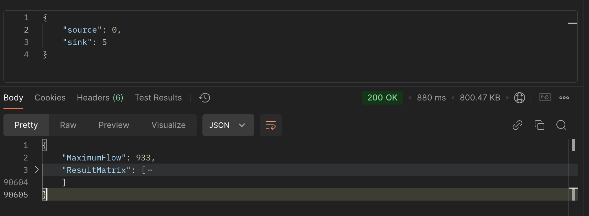

# MaxFlowProblem
## How to run Backend
-   First, you can create a virtual environment to ensure there are no version conflicts with the libraries.
-   Next, install the libraries listed in the `back_end/requirements.txt` file.
```bash
pip install -r back_end/requirements.txt
```
-   In the root directory **MaxFlowProblem**, run the command: 
```bash
python -m back_end.main
```
- The app will be available at the address [http://127.0.0.1:5000](http://127.0.0.1:5000). The APIs will accept the values of "source" and "sink" to run the algorithm and return the max flow value and the result matrix.

  
